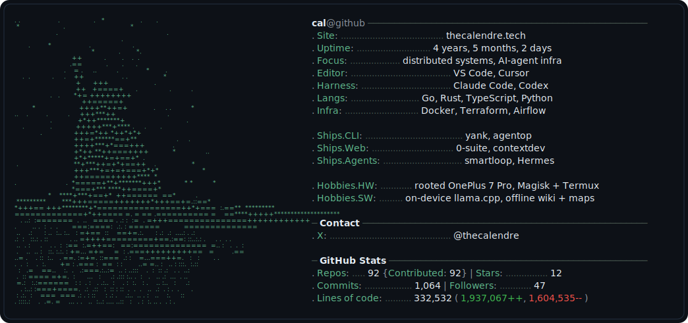

<a href="https://thecalendre.tech" target="_blank" rel="noopener">
  <picture>
    <source media="(prefers-color-scheme: dark)" srcset="./dark_mode.svg" />
    <source media="(prefers-color-scheme: light)" srcset="./light_mode.svg" />
    
  </picture>
</a>

<!--
  Generated card. dark_mode.svg / light_mode.svg — left panel is detail-segmented
  ASCII art of assets/portrait.jpg (the man reads solid, the sky is a star
  scatter, the rocks are dim), right panel is a neofetch card. The whole card
  links to thecalendre.tech (SVGs embedded as  can't carry per-line links on
  GitHub, so the card is one link; the X handle is shown under Contact). Stat
  fields (repos/contributed/stars/commits/followers/account age + lines of code)
  refresh daily via .github/workflows/build.yaml → stats.py. LOC uses GitHub's
  server-computed contributor-stats endpoint and is cached by pushed_at in
  loc_cache.json, so reruns only re-fetch changed repos. Regenerate the card
  layout/art: python build_svg.py
-->
